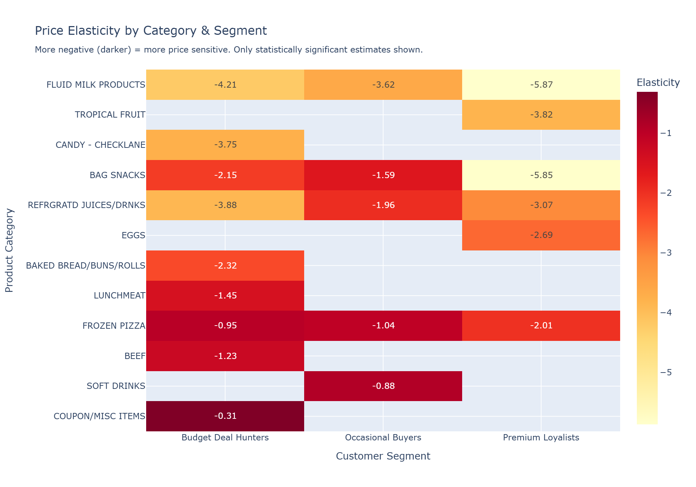
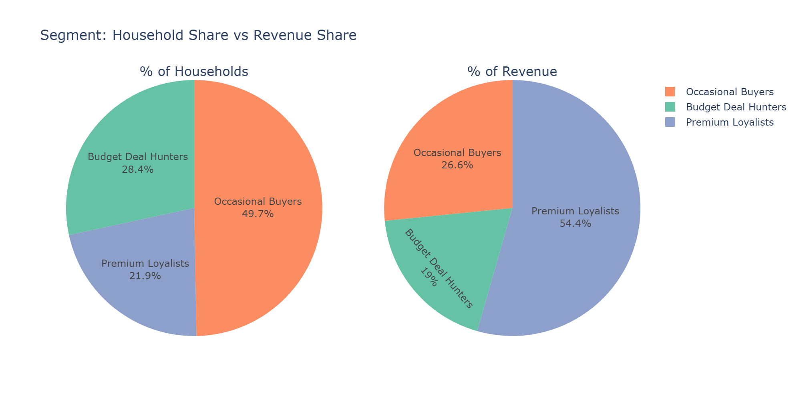
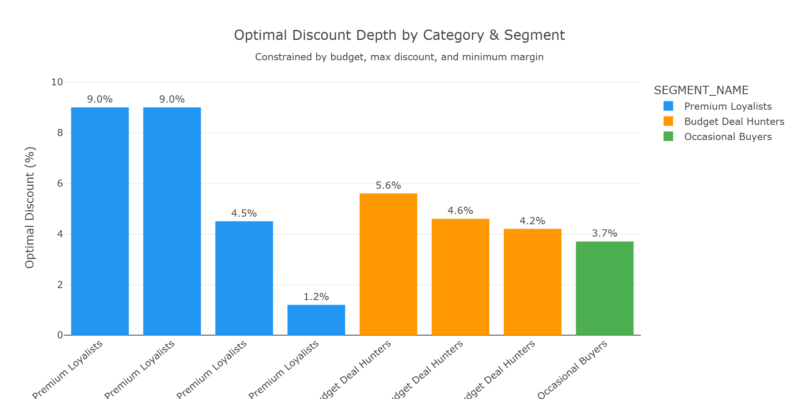
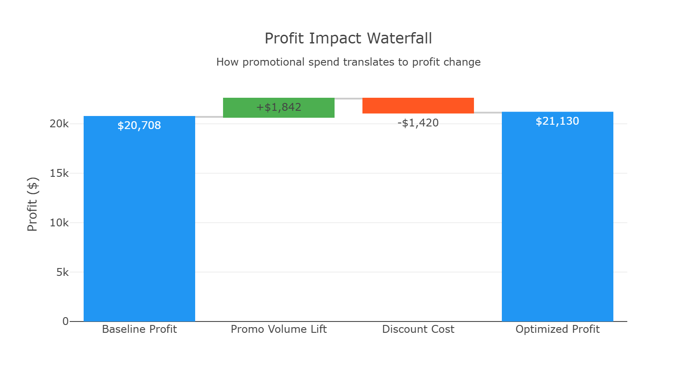
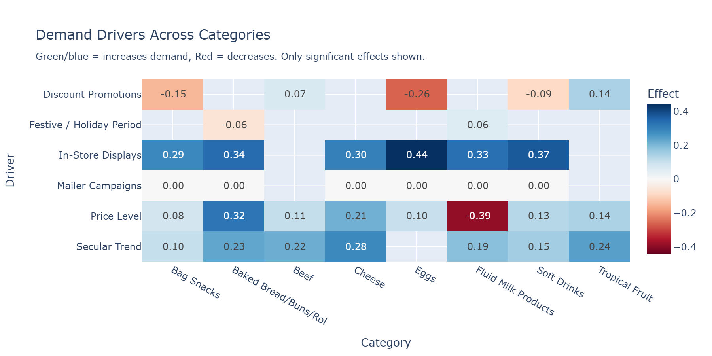

# Retail Promotion Intelligence Platform

**A decision-support system that helps CPG brands stop wasting money on promotions that destroy margin and start investing in ones that actually work.**

FMCG companies spend 15–25% of revenue on trade promotions — discounts, BOGO offers, in-store displays, mailers. Most of these decisions are gut-driven or based on "we did this last year." This project uses 2 years of household-level transaction data to answer three questions:

1. **Which customers respond to discounts, and which don't?**
2. **What type of promotion works best for each segment?**
3. **Given a fixed budget, where should we allocate promotional spend?**

Built on [Dunnhumby — The Complete Journey](https://www.kaggle.com/datasets/frtgnn/dunnhumby-the-complete-journey) (2,500 households, 100K+ transactions, coupon/display/mailer exposure data).

---

## Interactive Dashboard Insights

Here are the key visualizations generated by the optimization pipeline and interactive Streamlit dashboard:

### 1. Price Elasticity Heatmap (Hero Insight)
*Log-log OLS elasticity estimates by commodity category and customer segment. Only statistically significant results (p < 0.05) are shown. More negative values indicate higher price sensitivity.*


### 2. Segment Revenue & Distribution
*Customer segmentation using K-Means clustering. Shows a Pareto distribution where a high-value loyalist segment drives the vast majority of revenue despite being fewer in number.*


### 3. Optimal Budget Allocation
*The optimized trade promotion plan across categories and segments. The optimizer selects custom discount depths to maximize returns within budget and margin constraints.*


### 4. Promotion Profit Waterfall
*A step-by-step breakdown of profit impact: how baseline profits are shifted by promotional volume lifts, discount costs, and optimization rules.*


### 5. Demand Drivers Explainability Grid
*Standardized OLS regression coefficients mapping the impact of promotions, in-store displays, mailers, and holiday seasonality across categories.*


---

## Key Findings

**Finding 1 — Price sensitivity varies 4–6x across segments for the same product.**
Fluid Milk has elasticity of -5.87 for Premium Loyalists but -4.21 for Budget Deal Hunters. Running a uniform 10% discount across all customers wastes budget on less responsive segments.

**Finding 2 — Shallow discounts (5%) generate the highest ROI.**
A 5% discount on Bag Snacks for Premium Loyalists yields 4.9x ROI with 29% volume lift. Deeper discounts (15-20%) erode margin faster than they generate incremental volume.

**Finding 3 — BOGO destroys margin even with massive volume lift.**
Buy-1-Get-1-Free on Fluid Milk drives 294% volume lift but erodes margin by 269%. The volume is stockpiling, not incremental demand — households buy ahead and skip future purchases.

**Finding 4 — In-store displays are the strongest demand driver across all segments.**
Display placement has 2–4x more impact on demand than price discounts or mailers. Budget reallocation from discounts to display programs would improve ROI.

---

## Architecture

```
┌─────────────────────────────────────────────────────────────────────────┐
│                        DATA PIPELINE                                    │
│  8 CSVs → Clean → Merge → Feature Engineering → Master Table (Parquet) │
└────────────────────────────────┬────────────────────────────────────────┘
                                 │
                 ┌───────────────┼───────────────┐
                 ▼               ▼               ▼
        ┌────────────────┐ ┌──────────────┐ ┌──────────────────┐
        │  SEGMENTATION  │ │  ELASTICITY  │ │  EXPLAINABILITY  │
        │                │ │              │ │                  │
        │  RFM Features  │ │  Log-Log OLS │ │  Standardized    │
        │  K-Means       │ │  per category│ │  coefficient     │
        │  3 segments    │ │  per segment │ │  waterfall charts│
        └───────┬────────┘ └──────┬───────┘ └──────────────────┘
                │                 │
                └────────┬────────┘
                         ▼
              ┌──────────────────────┐
              │  PROMO SIMULATION    │
              │                      │
              │  7 promo types ×     │
              │  10 categories ×     │
              │  3 segments =        │
              │  210 scenarios       │
              └──────────┬───────────┘
                         │
                         ▼
              ┌──────────────────────┐
              │  BUDGET OPTIMIZER    │
              │                      │
              │  scipy.optimize      │
              │  (SLSQP)             │
              │                      │
              │  Maximize profit     │
              │  s.t. budget,        │
              │  max discount,       │
              │  min margin          │
              └──────────┬───────────┘
                         │
                         ▼
              ┌──────────────────────┐
              │  STREAMLIT DASHBOARD │
              │                      │
              │  Segment Explorer    │
              │  Elasticity Map      │
              │  Promo Simulator     │
              │  Recommendations     │
              └──────────────────────┘
```

---

## Pipeline Steps

| Step | Module | What It Does |
|------|--------|-------------|
| 1 | `data_pipeline.py` | Loads 8 Dunnhumby CSVs, cleans transactions, merges product/demographic/causal data, engineers price/discount/promo features, builds RFM table |
| 2 | `segmentation.py` | RFM + behavioral features → K-Means clustering (silhouette-optimized). Segments: Premium Loyalists, Occasional Buyers, Budget Deal Hunters |
| 3 | `elasticity_model.py` | Weekly demand aggregation → log-log OLS: `log(Q) = β₀ + β₁·log(P) + β₂·promo + β₃·display + β₄·mailer + β₅·festive + β₆·trend`. β₁ = price elasticity per category-segment |
| 4 | `promo_simulator.py` | Simulates 7 promo types (5-20% off, BOGO, bundle, cashback) per category-segment. Computes volume lift, revenue impact, margin impact, ROI, cannibalization |
| 5 | `budget_optimizer.py` | Constrained optimization (SciPy SLSQP): maximize profit subject to total budget, max discount depth, and minimum margin floor |
| 6 | `explainability.py` | Extracts standardized OLS coefficients as demand drivers. Waterfall charts show what increases/decreases demand per category |

---

## Tech Stack

| Layer | Tool | Why |
|-------|------|-----|
| Data processing | Pandas, NumPy | Standard tabular manipulation |
| Segmentation | Scikit-learn (K-Means, silhouette) | Unsupervised clustering |
| Elasticity | Statsmodels (OLS) | Interpretable coefficients, p-values, R² |
| Optimization | SciPy (SLSQP) | Constrained nonlinear optimization |
| Visualization | Plotly | Interactive charts with hover/zoom |
| Dashboard | Streamlit | Rapid prototyping, no frontend needed |
| Data format | Parquet | Columnar, compressed, fast reads |

---

## Dataset

**Dunnhumby — The Complete Journey** ([Kaggle](https://www.kaggle.com/datasets/frtgnn/dunnhumby-the-complete-journey))

| Table | Records | Key Fields |
|-------|---------|------------|
| Transactions | 100K+ | household, product, quantity, price paid, discounts |
| Products | 92K | department, commodity, brand, size |
| Demographics | 800 | income, household size, marital status |
| Causal | 3.6M | in-store display flag, mailer flag per product-store-week |
| Coupons | 1K+ | coupon campaigns with redemption tracking |

---

## Setup

```bash
git clone https://github.com/YOUR_USERNAME/retail-promotion-intelligence.git
cd retail-promotion-intelligence

pip install -r requirements.txt

# Download dataset from Kaggle, place CSVs in data/raw/
# https://www.kaggle.com/datasets/frtgnn/dunnhumby-the-complete-journey

python run_pipeline.py

streamlit run app/streamlit_app.py
```

---

## Project Structure

```
retail-promotion-intelligence/
├── data/
│   ├── raw/                        # Dunnhumby CSVs (gitignored)
│   └── processed/                  # Pipeline outputs (Parquet)
├── notebooks/
│   └── 01_data_exploration.py      # EDA with 8 chart outputs
├── src/
│   ├── data_pipeline.py            # ETL + feature engineering
│   ├── segmentation.py             # RFM + K-Means
│   ├── elasticity_model.py         # Price elasticity (OLS)
│   ├── promo_simulator.py          # What-if promo engine
│   ├── budget_optimizer.py         # Constrained profit optimization
│   ├── explainability.py           # Demand driver analysis
│   ├── chart_utils.py              # Chart export helpers
│   └── utils.py                    # Shared utilities
├── app/
│   └── streamlit_app.py            # Interactive dashboard (5 pages)
├── outputs/figures/                # Generated charts (HTML + PNG)
├── run_pipeline.py                 # Master runner (all 6 steps)
├── requirements.txt
└── README.md
```

---

## Dashboard Pages

| Page | What It Shows |
|------|--------------|
| **Overview** | KPIs, segment revenue share, discount sensitivity comparison |
| **Segment Explorer** | Select a segment → radar profile, demographics, purchase patterns |
| **Elasticity Map** | Heatmap of price sensitivity by category × segment, promo channel comparison |
| **Promo Simulator** | Pick category + segment → compare 7 promo types side by side with ROI/margin |
| **Recommendations** | Auto-generated business actions: where to invest, where to cut, strategy shifts |

---

## Resume One-Liner

> Built a retail promotion intelligence platform using econometric modeling (log-log OLS), customer segmentation (RFM + K-Means), and constrained budget optimization (SciPy SLSQP) on 2 years of household transaction data — with an interactive Streamlit dashboard that identifies optimal promo strategies per segment, showing that shallow 5% discounts yield 4.9x ROI while BOGO offers destroy 269% of margin despite 294% volume lift.

---

## Future Work

- **Time-series demand forecasting** (Prophet/LightGBM) to predict baseline demand before overlaying promo effects
- **Cross-category cannibalization** modeling — does promoting toothpaste steal from mouthwash?
- **A/B test simulation framework** to estimate required sample sizes for validating promo strategies
- **Real-time dashboard** with live data ingestion for in-flight campaign monitoring
